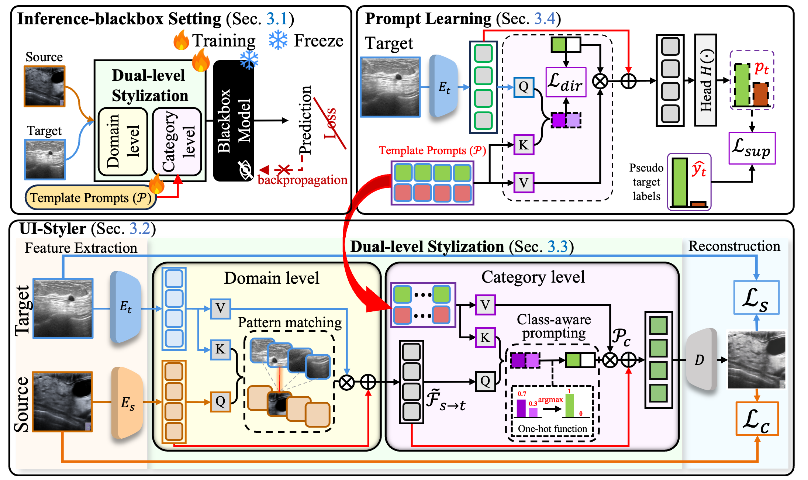

# UIStyler
UI-Styler: Ultrasound Image Style Transfer with Class-Aware Prompts for Cross-Device Diagnosis Using a Frozen Black-Box Inference Network

---

## 🧪 Abstract

Ultrasound images vary across devices, causing domain shifts that reduce the reliability of fixed black-box inference models. Unpaired image translation (UIT) methods can alleviate this, but most neglect class-specific alignment, leading to misaligned content-class mappings and reduced diagnostic accuracy. We propose UI-Styler, a **class-aware style transfer** framework for ultrasound. It employs a pattern-matching mechanism to transfer target-domain textures while preserving source structures, and a class-aware prompting strategy guided by pseudo labels to ensure semantic consistency. Experiments on cross-device tasks show that UI-Styler surpasses existing UIT methods, achieving state-of-the-art results in both distribution alignment and downstream tasks like classification and segmentation.

---

## 🏗️ Architecture

<p align="center">
  
</p>

---

## ⚙️ Installation

```bash
conda env create -f environment.yml
conda activate uistyler
```

> Requires Python ≥ 3.8 and a CUDA-enabled GPU for training.

---

## 📚 Dataset

Please follow the instructions in [DATASET.md](https://github.com/nycu-acm/UIStyler/tree/main/dataset/DATASET.md) to download and preprocess the four domains (**BUSBRA**, **BUSI**, **UCLM**, **UDIAT**) into the unified structure (`full/`, `train/`, `valid/` with `imgs/` and `masks/`).

---

## 🏋️ Training

1. Download the [pretrained perceptual weights](https://drive.google.com/file/d/1BinnwM5AmIcVubr16tPTqxMjUCE8iu5M/view).
2. Train (ensure `--source` ≠ `--target`):
   
   ```bash
   python train.py --source BUSBRA --target BUSI --device cuda:0
   # source and target ∈ {BUSBRA, BUSI, UCLM, UDIAT}
   ```

---

## ✅ Evaluation

```bash
# KID
python downstream/KID.py --source BUSBRA --target BUSI --gpu 0

# Classification (ViT-B/16)
python downstream/classification/test.py --source BUSBRA --target BUSI --device cuda:0

# Segmentation (SAMUS)
python downstream/segmentation/test_all.py --source_name BUSBRA --task BUSI
```

---

## 📎 References

```bibtex
@inproceedings{deng2021stytr2,
  title     = {StyTr^2: Image Style Transfer with Transformers},
  author    = {Yingying Deng and Fan Tang and Weiming Dong and Chongyang Ma and Xingjia Pan and Lei Wang and Changsheng Xu},
  booktitle = {IEEE Conference on Computer Vision and Pattern Recognition (CVPR)},
  year      = {2022}
}

@misc{lin2023samus,
  title         = {SAMUS: Adapting Segment Anything Model for Clinically-Friendly and Generalizable Ultrasound Image Segmentation},
  author        = {Xian Lin and Yangyang Xiang and Li Zhang and Xin Yang and Zengqiang Yan and Li Yu},
  year          = {2023},
  eprint        = {2309.06824},
  archivePrefix = {arXiv},
  primaryClass  = {cs.CV}
}
```
